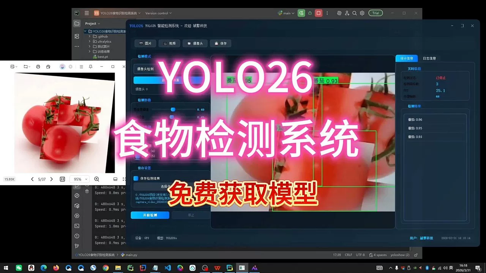
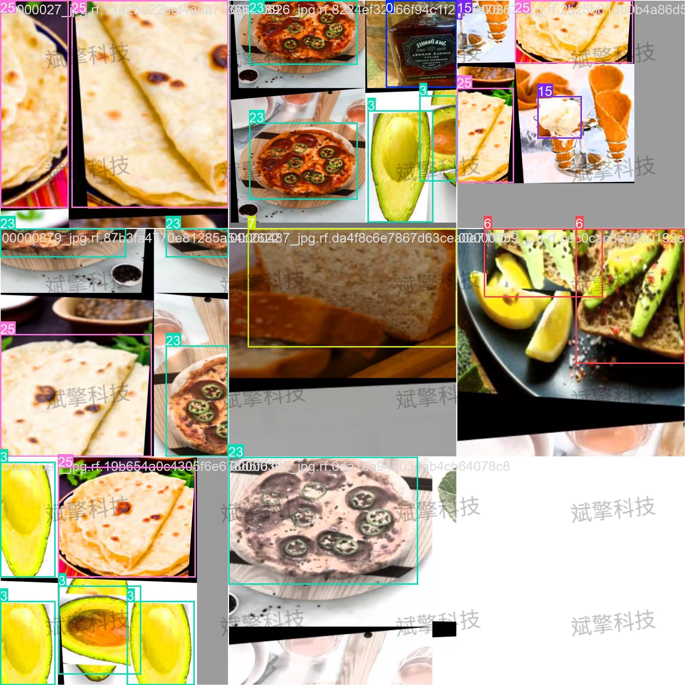
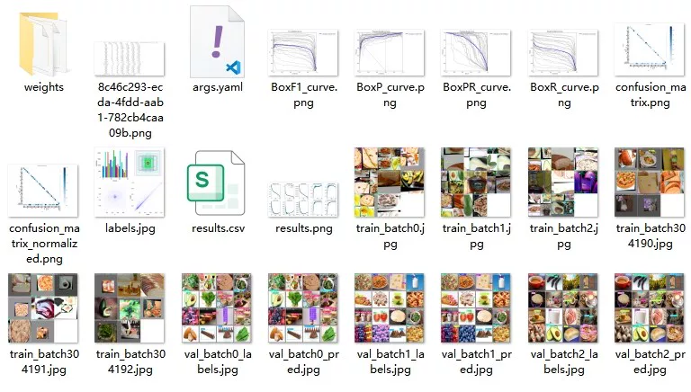
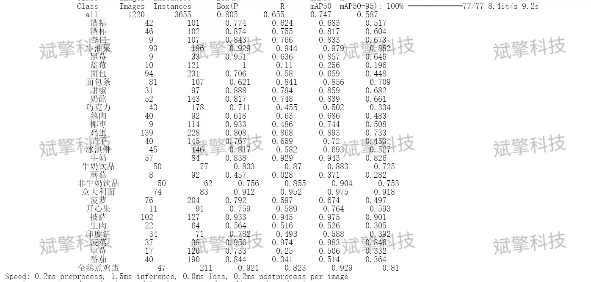
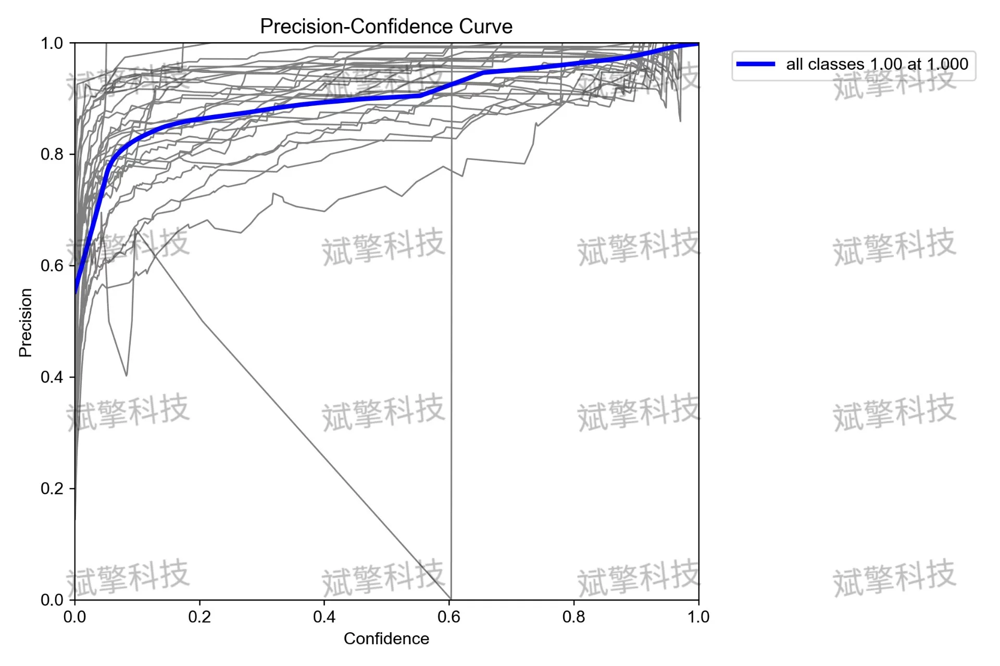
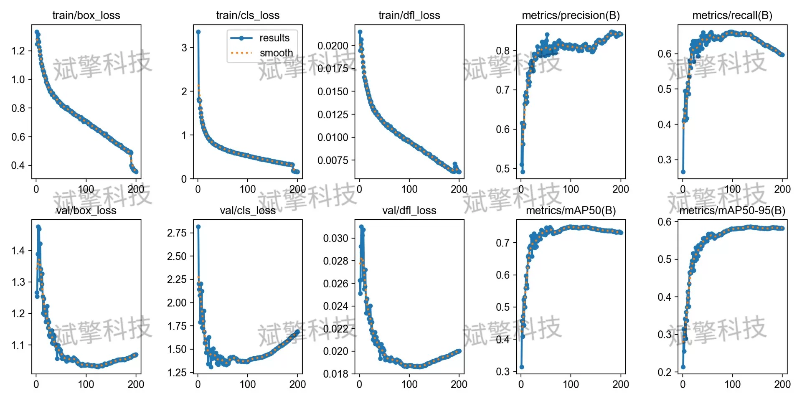
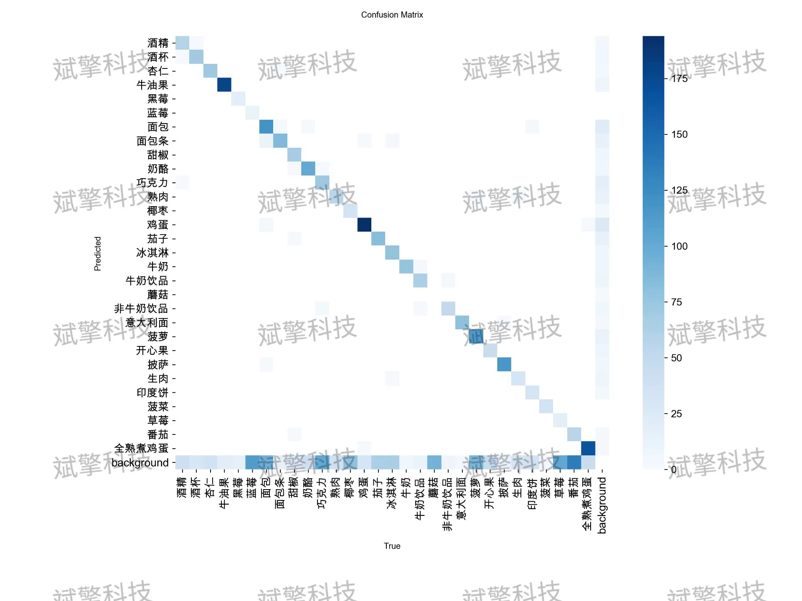
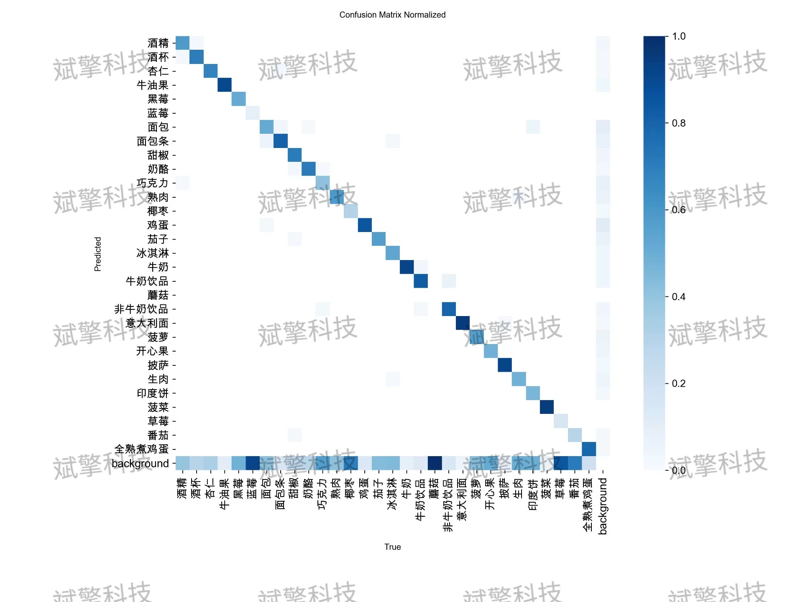
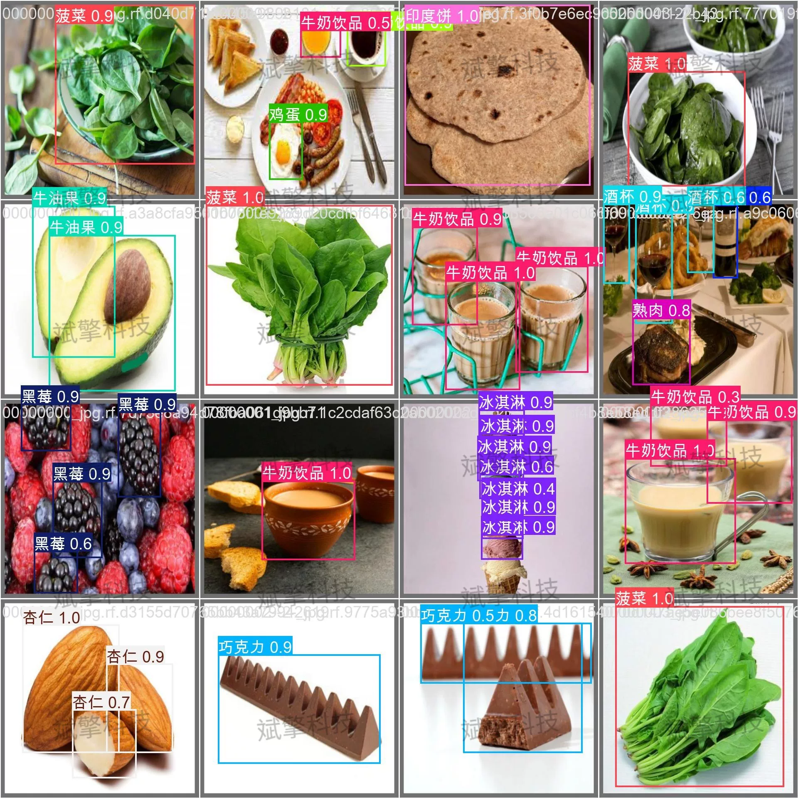

# YOLOv26 Food Identification Detection System | Dataset

## Body

YOLO26 Food Identification and Detection System | Data Set Project Real-World: Teach You How to Use YOLO26 to Achieve High Precision in Food Identification with an AP of 0.9 for Avocados, Pasta, and Eggs!

This article proposes and implements a high-precision food identification and detection system based on the YOLO26 (You Only Look Once) architecture. The system aims to solve the problem of multi-category food localization and classification in complex scenarios, constructing a dedicated dataset containing 30 common foods and beverages. The dataset includes training set (12,802 images), validation set (1,220 images), and test set (639 images), totaling approximately 14,661 images. Experimental results show that the model achieved excellent performance on the test set, with an average precision mean (AP@0.5) of 0.747 and a comprehensive accuracy (Precision) of 0.805, as well as a recall (Recall) of 0.655. The model performed particularly well in categories such as avocados, blackberries, pasta, and fully cooked boiled eggs (AP > 0.9), demonstrating its high accuracy and practicality in the field of food recognition. This provides reliable technical support for subsequent applications such as nutritional analysis and dietary record keeping.

Training set: 12,802 images.
Validation set: 1,220 images.
Test set: 639 images.

Free remote installation appointment. Unsuccessful full refund.
Purchase Enjoy the following resources (auto unlock in Baidu Pan):
   YOLO Identification Detection Project Complete Source Code
   YOLO format dataset
   Training code + UI interface code
   Trained model + result images
   Software install package
   Schedule a WeChat appointment for remote installation (automatically displayed after purchase) - Unsuccessful, full refund

⚙️ Core Function Modules
Detection Capability
    Image detection: upload and check immediately, return detection box + category information
    Video detection: supports video files, analyze each frame accurately
    Camera real-time detection: connect USB camera, realize dynamic monitoring
Interaction and Control
    Target selection: freely choose one or more categories for detection
    Parameter real-time adjustment: adjustable confidence threshold & IoU threshold, flexibly control accuracy
    Result saving: image/video/camera detection results saved instantly
System and Data
    User login registration: Support password strength detection + encryption storage
    Log recording: automatically records operation and error information (timestamped)

## Images

## Payment

Here is a pay link on Stripe ( https://buy.stripe.com/3cs8yP7sY87d0vu9AB ). Please contact me lonlonago@foxmail.com after funding $89, and I will send you a complete data files , thank you!

